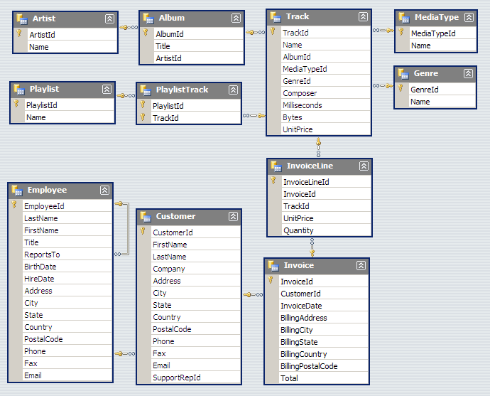

# Prep Work Week 1

## Information Systems, Databases and RDMBs

[Databases](https://en.wikipedia.org/wiki/Database) are a type of [(computer) information systems](https://en.wikipedia.org/wiki/Information_system). They organize collections of data, stored and accessed a computer system.

Imagine the following piece of information: Evan Cole was walking down the Cantersteen in Bruxelles at 9:30 on Sunday May 31st 2020. This sole sentence holds a lot of information but for a computer system this sentence isn't the optimal organisation of data.

Instead of storing the sentence, it's would be easier for a computer system if the information would be stored in a more structured way. Something like this:
- activity `walking`
- address.street `Cantersteen`
- address.city `Bruxelles`
- subject.full_name `Evan Cole`
- datetime `2020-05-31T09:30:00+01:00` (this is a specific format that is used to store datetimes: [ISO 8601](https://en.wikipedia.org/wiki/ISO_8601))

And it's exactly this kind of organized collection of data that a database allows you to store and access. The database will allow us to answer questions such as "Who was walking down Canterstee on May 31st 2020?" and "In which city was Evan Cole walking  on May 31st 2020?". The software systems that enable users to define, create, maintain and control access to the database are called [database management systems (DBMS)](https://en.wikipedia.org/wiki/Database#Database_management_system).

DBMSs come in all shapes and sizes. There are two big categories:
1. [Relational databases](https://en.wikipedia.org/wiki/Relational_database), most of them using [structured query language (SQL)](https://en.wikipedia.org/wiki/SQL) for storing and accessing data. Examples are [MySQL](https://www.mysql.com/), [Microsoft SQL Server](https://www.microsoft.com/en-us/sql-server/) and [SQLite](https://www.sqlite.org/index.html).
2. [NoSQL or non-relational databases](https://en.wikipedia.org/wiki/NoSQL) different query languages. Examples are [MongoDB](https://www.mongodb.com/) and [Apache Cassandra](https://cassandra.apache.org/).

In this module we will be working with one specific relational DBMS: [SQLite](https://www.sqlite.org/index.html).

Extra resources:

- [What is an information system - Charlie Love](https://www.youtube.com/watch?v=Qujsd4vkqFI)
- [What is a database - Charlie Love](https://www.youtube.com/watch?v=t8jgX1f8kc4)
- [What is Database & SQL? - Guru99](https://www.youtube.com/watch?v=FR4QIeZaPeM)
- [What are databases? - LinkedIn Learning](https://www.youtube.com/watch?v=Ls_LzOZ7x0c)

## Relational Model

Before we continue familiarizing ourselves with some concepts of the relational model, let's take a look at a concrete, sample database. In this module we'll be using the [Chinook](https://github.com/lerocha/chinook-database) database. It models data to represent a digital media store: artists, albums, media tracks, invoices and customers. [The database schema](https://en.wikipedia.org/wiki/Database_schema) for this database looks like this:

### Tables, Records, Attributes, Fields and Keys

The data is organized in multiple [tables](https://en.wikipedia.org/wiki/Table_(database)). Generally, each table represents an entity type (e.g. artists or customers).

Let's take a look what the content of the `Artist` table is (later on you'll be able to do this yourself):

| ArtistId | Name                 |
| -------- | -------------------- |
| 1        | AC/DC                |
| 2        | Accept               |
| 3        | Aerosmith            |
| 4        | Alanis Morissette    |
| 5        | Alice In Chains      |
| 6        | Antônio Carlos Jobim |
| 7        | Apocalyptica         |
| 8        | Audioslave           |
| 9        | BackBeat             |
| 10       | Billy Cobham         |
| ...      | ...                  |

As you can see each table consists of columns, rows and cells (very similar to spreadsheets):

- The rows represent instances of that type of entity. As you can see there's at least ten rows in our database, each one representing a specific instance of an `Artist`. E.g. the fifth row is an instance of an `Artist` (of which the name is Alice In Chains). Rows are also called records.
- The columns represent values attributed to that instance. There's two columns within the `Artist` table: `ArtistId` and `Name`. E.g. `5` is the `ArtistId` of the fifth row, `Alice In Chains` is the `Name`. Columns are also called attributes.
- Cells live at the intersection of a row and a column and holds a specific value. E.g. the name attribute of the fifth record has the value `Alice In Chains`. Cells are also called fields.

You'll notice that most of the time each table will have one attribute like `ArtistId` representing some kind of identifier (id) of the entity. Such identifier attributes are called keys. When the value for each record needs to be unique across all records for such a key attribute it's called [a primary key](https://en.wikipedia.org/wiki/Primary_key) (of which `ArtistId` is one). This key can then be used to identify each record.

Attributes also define the data type which the values of its fields should be. SQLite has [5 data types](https://www.sqlite.org/datatype3.html): NULL, integer, real, text and blob. In our example the primary key `ArtistId` 's data type is integer and the `Name` attribute's data type is text.

Okay, let's take a break from theory. Let's check out some data! Go to [this handy online SQLite viewer](https://inloop.github.io/sqlite-viewer/) and upload [our sample database file](chinook.sqlite). From the dropdown you'll be able to see the data of different tables. Don't worry about the `SELECT * FROM ...` "code" just  yet.

In total there are eleven tables in the Chinook sample database, all with various attributes. Use the SQLite viewer to check them out and get familiar with them. Don't panic if not all attributes make sense yet.

## SQL

As mentioned before most relational databases use [SQL](https://en.wikipedia.org/wiki/SQL) for storing and accessing data. SQLite is no different. This is going to be the focus point of this class: writing [SQL queries](https://en.wikipedia.org/wiki/SQL_syntax#Queries) to fetch data from a database.

Extra resources:

- [SQLite Tutorial - An Easy Way to Master SQLite Fast](https://www.sqlitetutorial.net/)
This is a very nice tutorial website which, surprise surprise, uses the same sample database as we use.
- [Learn basic SQL in 10 minutes - Janes Vance](https://www.youtube.com/watch?v=bEtnYWuo2Bw)
- [The Structured Query Language (SQL) - Dr. Daniel Soper](https://www.youtube.com/watch?v=kqUIoOM3WEs)
